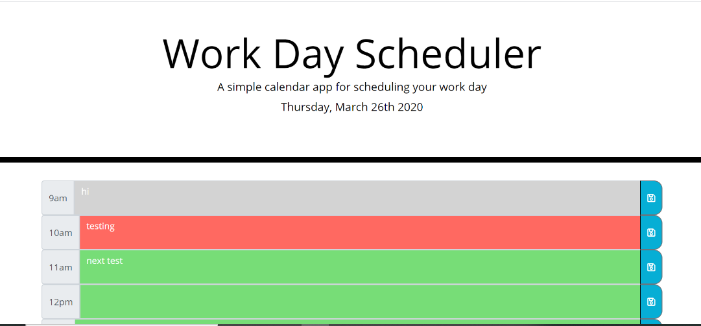

# Homework5
# 05 Third-Party APIs: Work Day Scheduler

## User Story

```
AS AN employee with a busy schedule
I WANT to add important events to a daily planner
SO THAT I can manage my time effectively
```

## Description

This application is a simple day planner.  For the current day, a page appears displaying today's date and entry fields for the hours 9am to 5pm.  Each time block is color coded as to whether that block is already past, is the current time block, or is in the future.  The user can enter an event in the time block  and save it.  That event will still be displayed when the page is refreshed.  

## Completed

```

* Current day is displayed at top of page.
* Timeblocks are shown for each of the business hours.
* Timeblocks are color coded for past, present and future.
* Events can be entered into time blocks and saved so that they can be viewed even if page is refreshed.
* HTML was validated.
```

## Application URL

https://robynp108.github.io/Homework5/

## Application Screenshot


